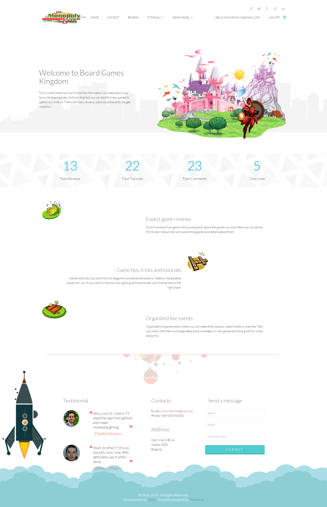
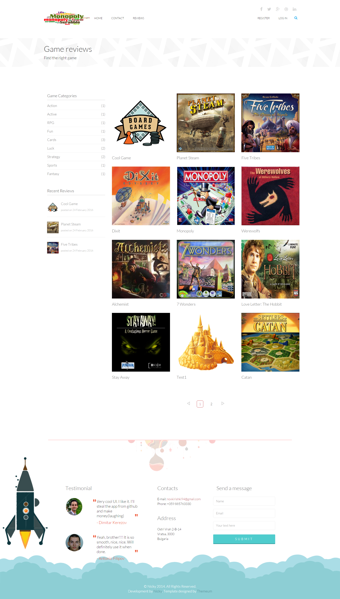
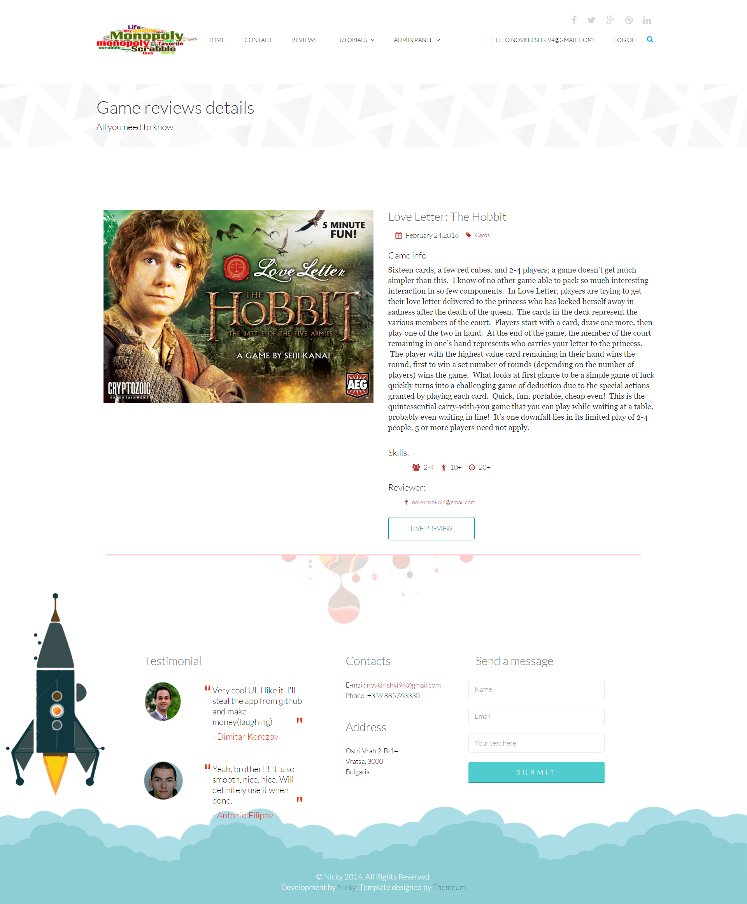
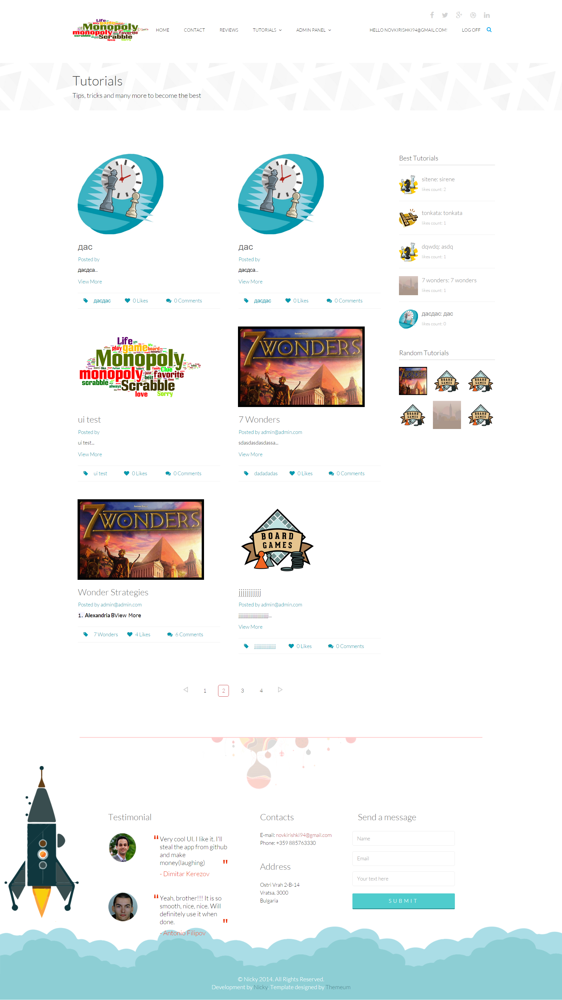
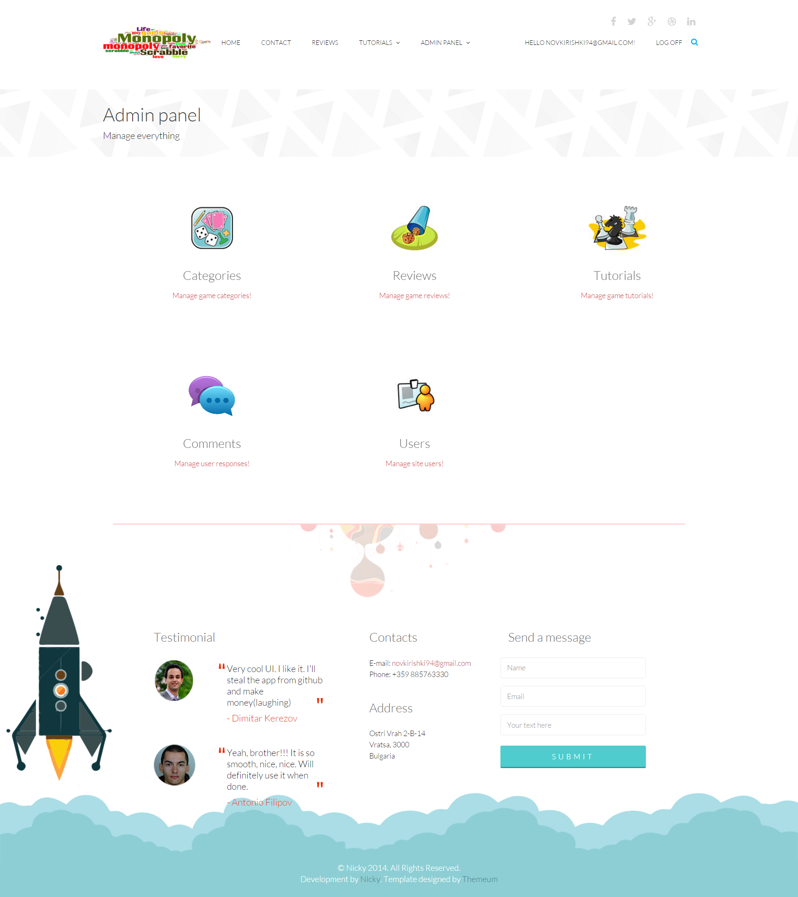
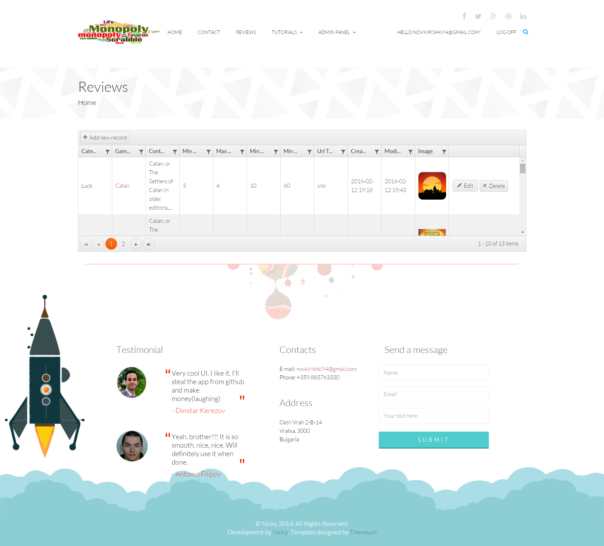
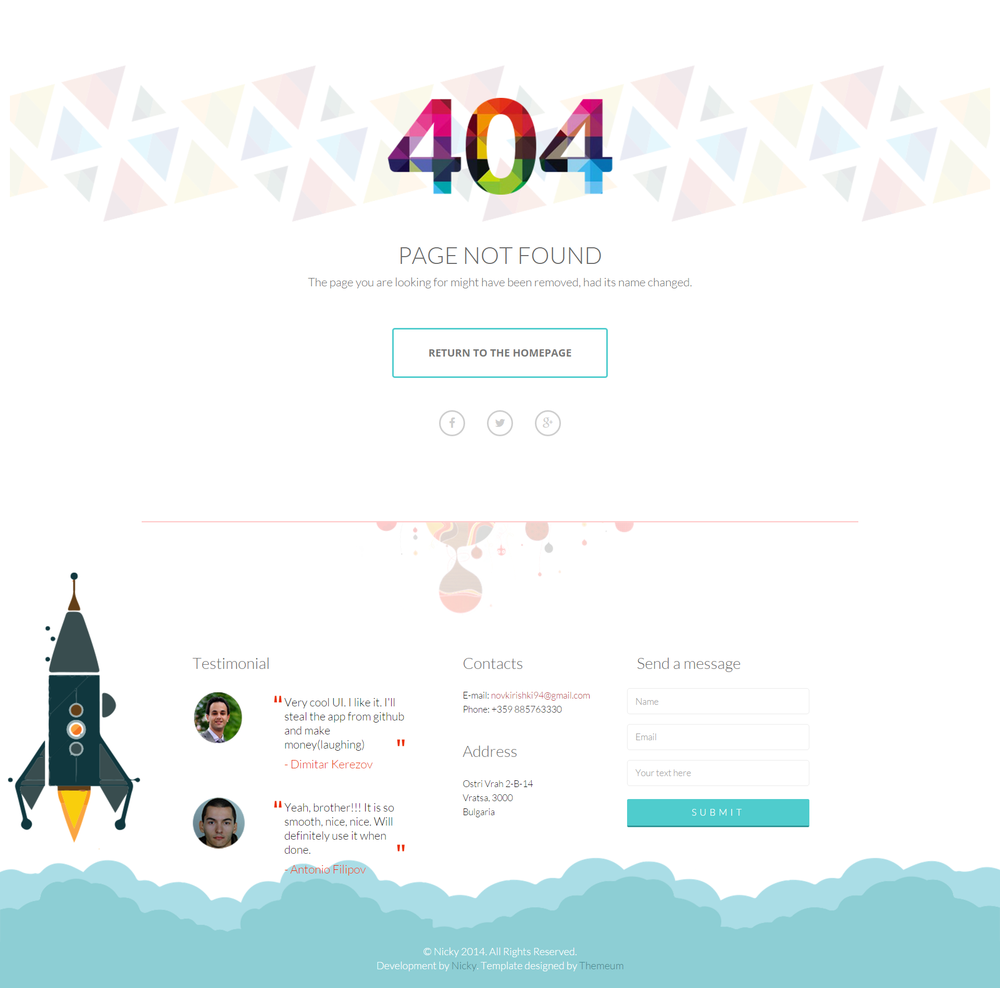

# Board Games Kingdom - ASP.NET MVC Final Project

This is a web application where you can find information about your favourite board games. Not only that but you can also find new games to spend your time on.

## Description

There are two main things users can enjoy in the site - reviews and tutorials. Game reviews have the purpose to inform the user about a board game(description, min/max players, playing time, category, etc.). Tutorials can be made by every user and target other users. There they can see tips, tricks, guidelines and many more for different games. Both reviews and tutorials have one cover image, which is uploaded on creation. However their contents can be html, so the creater can include everythng he likes and structure it the way he likes. Tutorials can be liked/disliked and commented by users. In the future events will be added, so users can sign up for a live event where they can meet other users, play games and test their skills.

### Public Part

The public part includes the Home, Contacts, Login/Register and Game reviews pages. Users can browse game reviews (which are added only by administrators) and can see game review details. Each game review has a category which shows the type of game reviewed.

### Private Part (Users only)

The private part includes Tutorials. Tutorials can be made by both regular users and admins. Users can browse tutorials and see their details. Each user can like and comment different tutorials. Of course they can also do everything a non registered user can.

### Administration Part

Administrators can create, update, delete and view details for everything in the app(users, tutorials, comments, reviews, categories). For each object there is a Kendo Grid.

## General Requirements

* Use **ASP.NET MVC** and **Visual Studio 2015** with Update 1 - done
* Have at least **15 controllers** - done
	* Admin area 
		* Categories
		* Comments
		* Home
		* Reviews
		* Tutorials
		* Users
	* Private area 
		* Comments
		* Likes
		* Tutorials
	* Public area 
		* Reviews
		* Account
		* Contacts
		* Files
		* Home
		* Statistics
		* Manage
* Have at least **40 actions** - done
* You should use **Razor** template engine for generating the UI - done
	* You may use any JavaScript library of your choice - done
		* For example Kendo UI widgets (with the ASP.NET MVC Wrappers), Chart.js for charts, etc.
	* ASP.NET WebForms is not allowed - done
	* Use at least **3 sections** and at least **10 partial views** - done
	* Use at least **10 editor or display templates** - done
* Use **MS SQL Server** as database back-end - done
	* Use **Entity Framework 6** to access your database
	* Using **repositories and/or service layer** is a must
* Use at least **2 areas** in your project (e.g. for administration) - done
	* admin
	* private
	* public 
* Create **tables with data** with **server-side paging and sorting** for every model entity - done
	* You can use Kendo UI grid, jqGrid, any other library or generate your own HTML tables
* Create **beautiful and responsive UI** - done
	* You may use **Bootstrap** or **Materialize**
	* You may change the standard theme and modify it to apply own web design and visual styles
* Use the standard **ASP.NET Identity System** for managing users and roles - done
	* Your registered users should have at least one of the two roles: **user** and **administrator**
* Use **AJAX form and/or SignalR** communication in some parts of your application - done
	* Comments are send and updated with AJAX
	* Likes are send and updated with AJAX
	* Messages are send and updated with AJAX
* Use **caching** of data where it makes sense (e.g. starting page) - done
	* stats on home page
	* best tutorials side menu
	* random tutorials side menu
	* categories side menu
	* latest reviews side menu
* Use **Ninject** (or any other dependency container) and **Automapper** - done
* Write at least **30 unit tests** for your logic, controllers, actions, helpers, routes, etc. - done
* Apply **error handling** and **data validation** to avoid crashes when invalid data is entered (both client-side and server-side) - done
* Prevent yourself from **security** holes (XSS, XSRF, Parameter Tampering, etc.) - done
	* Handle correctly the **special HTML characters** and tags like `<script>`, ` `, etc.
	* Content that allows html is sanitized before being showed
* Use GitHub and take advantage of the **branches** for writing your features. - done
* **Documentation** of the project and project architecture (as `.md` file, including screenshots) - done

## Application live demo

[The demo at this link](http://boardgameskingdom.azurewebsites.net/)

## Application screenshots
#### Database models

#### Home Page

#### Revies Page

#### Review Details Page

#### Tutorials Page

#### Tutorial Details Page

#### Admin Panel Page

#### Admin Page with Kendo

#### Sample Error Page
